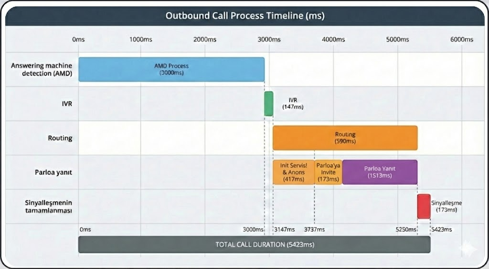

I have a very nice time line diagram which created by AI tools (nano banana)
I searched for commercial apps to create a time line diagram with similar display. The closest options are gantt schemas which doesn't display cascaded events. Eg "Parloya Yanıt" line in the gpicture I uploaded has 3 cascaded events.

I'd like a create a web application.
Here are my requirements
- Lets start with a single page web app. 
- I need to add the lanes. Eg. "Answering machine detection (AMD)" 
- let me select color of each box.
- I should be able to add sequential boxes.
- There  should be 3-4pixels gap between boxes.
- I need to add boxes. Eg. The Green box "IVR (147ms)"
- I prefer to create the diagram with click-and-drag. And add the duration in seconds or miliseconds.
- I'd like to add initial start time in "HH:MM:SS sss" format.
- The duration information of boxes should be interconnected and re-scaling the diagram scales all the boxes to proper width.
- 